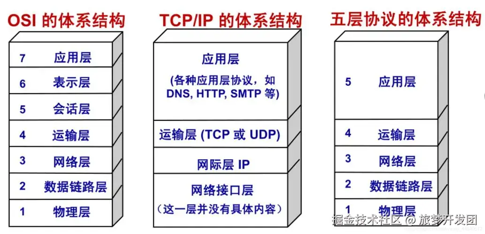

- 二维数组arr 生成一个数组，包含所有的组合，其中每个组合由arr的每个子数组中的一个元素组成
let arr = [ [1, 2], [3, 4], [5, 6] ];
输出
[ [1, 3, 5], [1, 3, 6], [1, 4, 5], [1, 4, 6], [2, 3, 5], [2, 3, 6], [2, 4, 5], [2, 4, 6] ]

    - 全排列问题
    通过递归去实现

- 设计模式  Design Pattern
    不是具体业务，而是 focus 代码设计
    - 登录弹窗
        单例 只需要实例化一次
        点击登录，点赞  评论等设计用户权限的地方
    - 接口  实现这个接口    面向接口编程 
        static getInstance  不用去 new
    - 两种写法
        - 面向对象
        - 闭包 

- 最长递增子序列
    - 最值问题用动态规划或贪心算法解决
    - 递归是自顶向下解决问题，（函数入栈） dp 自底向上问题（状态转移问题）
    - 递归的思考去考虑规则
    - dp 状态转移方程
    - 局部最优解和全局最优解是保持一致的，和贪心的本质区别

- 动态规划，买股票
    - 最值问题 动态规划   状态转移方程
        - 最优子结构  局部是和全局一致的   状态转移方程 
        - dp 动规五部曲
            dp[] 集合意义
            初始化
            状态转移方程
            迭代
            最值

         let n = prices.length;
        if(n==0) return 0;
        let dp = new Array(n).fill(0);
        let min = prices[0]
        for(let i=1;i<n;i++){
            min = Math.min(min,prices[i]);
            dp[i] = Math.max(dp[i-1],prices[i]-min);
        }
        return dp[n-1];

        
    - 贪心算法
        - 在每个决策点都选择当前看起来最优的选择，不会积累之前的最值

         let min = Infinity;
        let result = 0;
        for(let i=0;i<prices.length;i++){
            min = Math.min(min,prices[i]);
            result = Math.max(result,prices[i]-min);
        }
        
        return result;

-   假如没有ip地址只使用Mac地址会有什么问题   （ip地址和Mac地址）
    - IP地址是用于在计算机网络中标识设备位置的唯一地址，帮助设备进行数据通信和路由。
    - MAC地址是网络设备的物理地址，由制造商分配，用于在局域网内唯一标识设备并控制网络通信。
        IP地址用于在网络层标识设备的位置，以便在不同网络之间路由数据，而MAC地址用于在链路层唯一标识设备，确保在同一局域网内可靠地传输数据。两者结合使用，使得数据能够准确地找到并传送到目标设备，无论是在局域网内还是跨网络的通信中。

        

- 死锁有什么解决办法
    进程是分配应用资源的最小单位，线程是执行的，多个线程由进程管理。
    死锁是指两个或多个进程在执行过程中，因争夺资源而造成的一种互相等待的现象，若无外力作用，它们都将无法推进下去。

    - 解决方法
        锁超时
    - 死锁避免
        银行家算法

- CSS中的长度单位 
    一个CSS像素不等于物理像素
  - 绝对单位
    - px 像素

  - 相对单位
    - em 相对单位  父元素的字体大小
    - rem 相对单位  根元素的字体大小  -》 flexible.js
    - vw 相对单位  视口宽度的百分比
    - vh 相对单位  视口高度的百分比
    - % 相对单位  父元素的百分比

- 手写Promise.all
    Promise  处理并发请求的方法 

