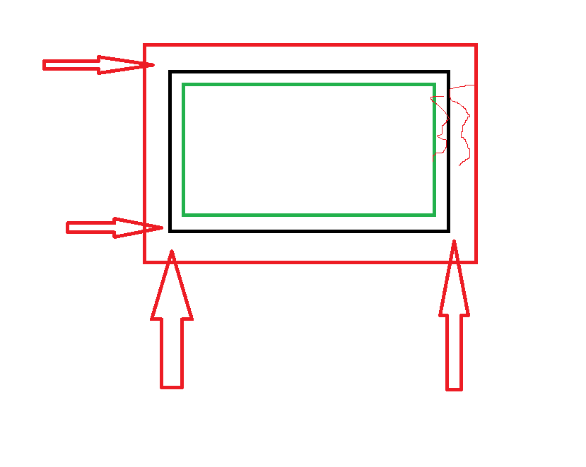

# 说说你对css盒子模型的理解
1. 是什么
    当浏览器在渲染一个html容器时，会根据某一个标准来绘制出一个矩形，该矩形包含 content padding margin border 等元素。

2. 原理(有哪些盒模型)
    - 标准盒模型（谷歌）
        width = content    总体宽度 = content + border + margin
       

    - IE 盒模型 
        width = content + border + padding 
        总宽度 = content + border + padding + margin
   

3. 应用场景
 如何切换盒模型
    - 标准盒模型
        box-sizing: content-box;
    - IE盒模型
        box-sizing: border-box;

# 说说css中的选择器有哪些？优先级是怎么样的？
    1. id
    2. class
    3. 标签
    4. 后代选择器的权重高不高取决于有没有 id  ，两代的打不过三代
    5. 子集选择器 .class > .class 只选择父类标签的儿子标签，孙子以及更深的标签不会被选取
    6. 兄弟选择器 选后面的相邻的兄弟，选two
         .one + .two{
            color: red;
         } 
    7. 群组选择器
    8. 伪类选择器
    9. 伪元素选择器 .class::before 
    10. 属性选择器 给要修改样式的元素添加属性 data-index ，style 中 .class[data-index]
    11. !important 最高权重

    - 能改得动字体的属性可以继承
        - font-size
        - font-family
        - color
        - font-weight
        - text-align: center;
        - decoration

    - 且集成优先继承父类的
    - important > 内联 > id  >  class > 后代选择器 = 子集选择器 = 兄弟选择器（顺序放后面的会优先） > tag > * > 继承 > 默认

# 说说em、px、rem、vw、vh的区别
    - 是什么：都是css中的单位，这些单位灵活使用可以做不同的适配
    - 区别：
        - em 是相对父元素的字体大小  1em = 父元素的字体大小
        - px 是固定的像素
        - rem 是相对根元素的字体大小
        - vw 是相对于视窗宽度的百分比
        - vh 是相对于视窗高度的百分比-

# css中有哪些隐藏容器的方式？区别是什么？
        1. display: none;  dom 结构在 无文档流，不能绑定事件
        2. opacity: 0;  透明度为0, 占据文档流，可以绑定事件
        3. width: 0;  height: 0;   不占据文档流
        4. visibility: hidden;    高度为0，不占据文档流，不能绑定事件
        5. clip-path: polygon();  多边形裁剪,裁剪的必须是封闭，有文档流，不可以绑定事件