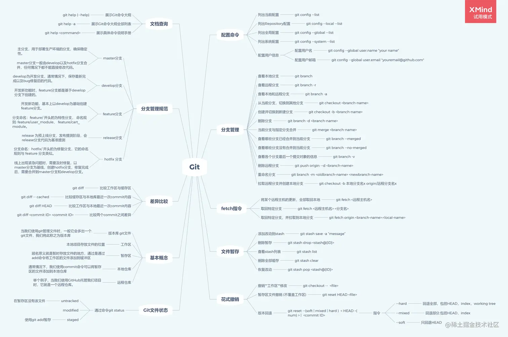

- 概念
    重排
        布局信息发生改变的时候，

    重绘
        元素的外观发生改变的时候，

    html DOM 树 + css OM 树 = render tree  
    LayOut tree   分层  图层合成
    渲染引擎  ->  绘制

    动态修改

    重排一定会重绘
    重绘不一定会重排

- 如何优化
    - 从 JS 引擎 切换到 浏览器渲染引擎 ，有点慢 
        .style.color  不要用这种去修改
        减少style, 用类名切换

    - 让 DOM 先下线 
        display:none
        文档碎片

    - css  动画  或动态效果
        不用 style 来做，交给 css 动画（浏览器优化了）

    - 一万条数据怎么渲染  举个例子
        - 文档碎片
        - requestAnimationFrame  比 setTimeout  更靠谱   刷帧率
        - 减少  offsetWidth  offsetHeight  getBoundingClientRect  等属性的调用，立马触发重绘重排
        - 对于包含大量图片或其他资源的页面，可以使用懒加载技术，只在需要时加载这些资源。可以使用第三方库如 lozad.js 或者直接使用HTML5的 loading="lazy" 属性。

- git 操作
    - 日常 git 提交
    - branch   分支   在自己的分支上做事情，然后合并到主分支上
    - git 操作的规范
        commit 记录
        - log 
        - 回退。。。比对
    https://liaoxuefeng.com/books/git/introduction/

    
        
    - 初始化Git仓库 
        git init
    - 克隆远程仓库
        git clone  URL_ADDRESS
    - 查看提交历史
        git log
分支操作
    - 创建新分支 
        git branch <name>
    - 切换分支
        git checkout <name>
    - 合并分支
        git merge <name>
    - 删除分支
        git branch -d <branch_name>
远程操作
    - 删除远程分支
        git push origin --delete <branch_name>
    - 查看远程分支
        git branch -r
    - 查看远程仓库
        git remote -v
    - 添加远程仓库
        git remote add origin URL_ADDRESS

 撤销和恢复
    - 撤销修改
        git checkout -- <file>
    - 恢复修改
        git checkout <file>
    - 撤销提交
        git reset --hard HEAD^
    - 恢复提交
        git reset --hard HEAD
    - 撤销所有修改
        git checkout.
    - 恢复所有修改
        git checkout --.
    - 撤销所有提交
    

- get  post 区别
    - 根据restful 一切皆资源
        请求方法  get 请求  post 新增
            patch/put 修改   delete 删除

    - get  -> 做查询
        不安全，因为参数会在URL中可见
        URL长度有限制（不同的浏览器有不同的限制，但通常不超过2048个字符）
        可以被浏览器缓存
        是幂等的，即多次相同的GET请求会产生相同的结果

    - post  -> 做提交
        相对更安全，数据出现在body中
        不是幂等的，即多次相同的POST请求可能会产生不同的结果
        没有数据大小的限制

    - 请求组成
        - 请求行 
            协议
            URL
            请求方法
        - 请求头
            get 请求的资源在这里
        - 请求体
            get 无请求体

- vue  组件通信
    - 父子组件通信  defineProps  defineEmits  数据原则   缺点：数据需要一级一级传递，毫无关联的组件间不能传
    - pinia   共享  中央 store   
    - provide/inject   vue-router  源码看到了  
    - vuex  比 pinia 复杂一点  mutation 

- vue2/3 区别
    - 有些老项目
        项目复杂时  vue3 比 vue2 有优势
    - Composition API     ref  reactive ...  代码的逻辑更好组织 
    - vue2 类式编程  this  受限于  data methods  computed  
    - 生命周期
        - vue2
            beforeCreate/created   beforeMount/mounted  beforeUpdate/updated  beforeDestroy/destroyed  errorCaptured
        - vue3

    - Typescript
        vue2 对 ts 不友好
        vue3 全面支持 ts 大型项目
    - 响应式原理  defineProperty  proxy
    - diff 算法

- 空对象
    使用 Object.keys 或 Object.entries

    使用 for...in 循环,遍历对象的所有键名，检查是否有任何键名

    使用 Object.getOwnPropertyNames 或 Object.getOwnPropertySymbols

    使用 Object.values

    使用 JSON.stringify ,将对象转换为 JSON 字符串，然后检查字符串是否为 {}

    Reflect.ownKeys,获取对象自身的所有键名，包括符号键。

- 算法题
    - https://juejin.cn/post/6947842412102287373?searchId=202408061701131ACA60F669DA18477F88

- 小公司老板心理 
        - 前端基础还可以， vue 实战能力ok

        - 
        单例是可以全局访问并且仅实例化一次的类。这个 单一实例 是可以在整个应用中被共享的，这使得单例非常适合管理应用程序中的全局状态

